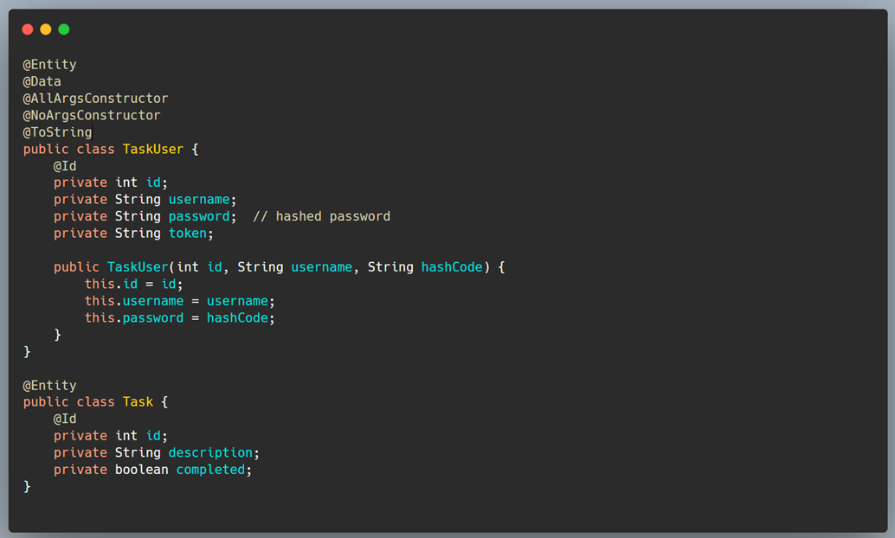
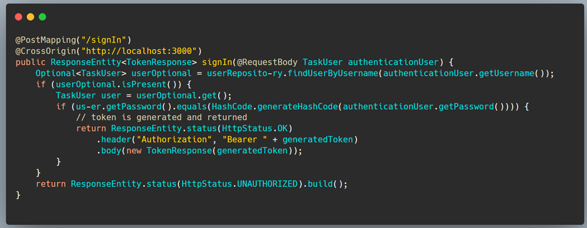
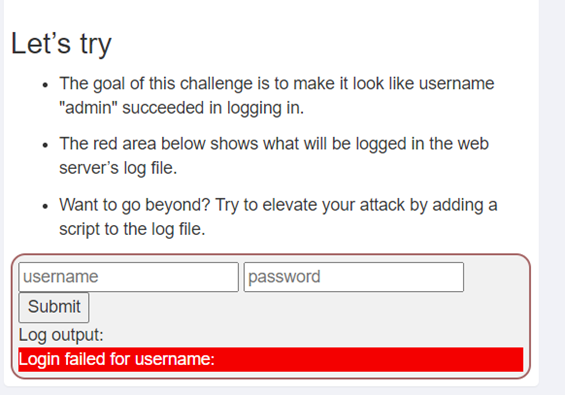

1. Zusammenfassung der Aufgabe zur Implementierung von Spring Security mit Thymeleaf
=======================================================================================

1.1 Modul 183 – Spring Security undThymeleaf
------------------------------------------------

#### Was ist mit Sessions?

Spring Security bietet vierverschiedene Ansätze zur Erstellung von Sessions:

1. **ALWAYS**: Erstellt bei jedem Zugriff eine Session.

2. **IF\_REQUIRED**: Erstellt nur eine Session, wenn es notwendig ist.

3. **NEVER**: Erstellt keine neuen Sessions, verwendet aber vorhandene.

4. **STATELESS**: Erstellt keine Sessions, Authentifizierung muss bei jedem Requesterneut durchgeführt werden.

1.2 Lernaufgabe: Spring SecurityLogin
----------------------------------------

Für die Lernaufgabe wird ein neues SpringInitializer Projekt erstellt mit den zusätzlichen Abhängigkeiten:

Immer die neueste Version verwenden, dieauf Maven Central zu finden ist.

1.3 Spring Security Configuration
------------------------------------

Erstelle eine Konfigurationsklasse fürSpring Security:

- authorizeRequests(): Erlaubt anonymenZugriff auf \`/login\`.

- formLogin(): Konfiguriert das Verhaltender Formularanmeldung.

- PasswordEncoder: Verwendet BCrypt zurPasswortverschlüsselung.

 

1.4 Security Dialect in Thymeleaf View
------------------------------------------

Der Spring Security Dialekt ermöglicht es,Inhalte basierend auf Benutzerrollen anzuzeigen:

- sec:authorize:Steuert die Anzeige vonInhalten basierend auf Rollen.

- sec:authentication:Zeigt Informationenüber authentifizierte Benutzer an.

1.5 Sicherheit auf HTTP-Header-Ebene
--------------------------------------

Spring Security fügt sinnvolle HTTP-Headerhinzu:

- Cache-Control: Verhindert Caching vongesicherten Seiten.

- Content-Type-Options: Verhindert dasErraten von Inhaltstypen durch den Browser.

- HSTS: Erzwingt HTTPS.

- X-Frame-Options: Verhindert Einbettung inIframes.

- X-XSS-Protection: Schaltet Browserschutzgegen XSS ein.

1.6 Granted Authority vs. Role
----------------------------------

- **GrantedAuthority**: Spezifische Berechtigungen wie \`READ\_AUTHORITY\`.

- **Role**: Allgemeinere Rollen wie\`ROLE\_USER\`.

**Spring Method Security**

Aktiviere Methodensicherheit:

- @Secured: Spring-spezifische Methode.

- @RolesAllowed: Java-Standard.

- @PreAuthorize, @PostAuthorize: Spring-SpezifischeMethoden.

1.7 Anwendungserstellung mit Token-basierter Authentifizierung
----------------------------------------------------------------

In einer Client-Server-Architektur, wiez.B. einer React-App mit einer RESTful API, erfolgt die Authentifizierung durch Token-Austausch. Erstelle eine REST API mit UUID-Token und implementiere diesein einer Task-Verwaltungsanwendung.

1.8 Backend Entities
------------------------

1.9 UserController SignIn Methode
-------------------------------------

2 Security logging Failures (A9) – Zusammenarbeit mit Liam Gleeson
=====================================================================

2.1 Konzept
--------------

Logging ist sehr wichtig in modernenSystemen, es wird gebraucht für diese Gründe:

- Applikation monitoren und debuggen
- Audit logging, Aktionen vonUsern und vom System loggen
- Informationen zu einem SIEModer SOAR System geben und damit sicherheits Aktionen eingreifen

2.2 Aufgabe 1: Let’s try
---------------------------

Das Ziel dieser Herausforderung ist es, den Anschein zu erwecken, dass der Benutzername "admin" erfolgreicheingeloggt ist. Der Rote bereich ist ein Log vom Server.

Nachdem man den Username ‘admin’ eingebeben, das System zeigt imm Frontend dass man eingeloggt ist, aber imBackend bei den Logs zeigt es das gegenteil, das kann sehr gefärlich sein.

2.3 Log-Spoofing:
--------------------

*   Log-Spoofing ist ein Problem, wenn Benutzer versuchen, Logdateien zu manipulieren.

*   Methoden: URL-Parameter oder speziell gestaltete JSON-Payloads.

*   Wichtige Maßnahmen:

2.4 Logging sensiblerInformationen:
--------------------------------------

*   Sensible Daten, wie Passwörter, sollten nicht in Logs enthalten sein, um Missbrauch zu verhindern.

*   Weitere sensible Daten, die nicht geloggt werden sollten: symmetrische oder private Schlüssel, Zugriffstoken, usw.

2.5 Logging persönlicherInformationen:
-----------------------------------------

*   Persönliche Informationen, wie Bankdaten oder persönlich identifizierbare Informationen, sollten nicht ohne Zustimmung des Nutzers geloggt werden.

*   Verhindern, dass Logs zur Profilbildung oder Überwachung von Personen verwendet werden können.

2.6 Besonderer Fall:Zugriffsprotokolle:
------------------------------------------

*   Zugriffsprotokolle sollten mindestens enthalten: Herkunft der Anfrage, Zeitpunkt der Anfrage, und möglicherweise den Antwortcode.

*   Weitere Informationen können abhängig von der Sicherheit des Logs enthalten sein.

*   Problem: Zugriffsprotokolle können die vollständige URL einschließlich sensibler Parameter erfassen. Daher sollte darauf geachtet werden, was in die URL als Parameter aufgenommen wird und dass solche Informationen nicht in öffentlich zugänglichen Logs protokolliert werden.

2.7 Zweite Aufgabe
---------------------

Bei dieser Aufgabe musste ich in die Logsgehen und ich fand dieser Log:

Jetzt hatte ich dass Passwort aber es warnoch encoded.

Dann ging ich auf die GitHub Seite desProjektes und schaute mit welcher Technologie es encoded wurde. Dann decodedeich es und bekam das passwort und habe die Aufgabe gelöst.

2.8 Log-Spoofing und Schutzsensibler Informationen:
------------------------------------------------------

*   Einfache Codierung/Decodierung ist keine sichere Methode zum Schutz sensibler Informationen in Logs.

*   Bessere Techniken umfassen: Daten nicht loggen, sie ausblenden oder mit einem anderen gemeinsamen Geheimnis verschlüsseln.

**WeitereThemen**:

- **Log-Level**:

- **Exception Handling**:

- **Audit Logging, Security Event Monitoring (SEM) und Anwendungslogs**:

2.9 Was ist beim Workshop gelernt habe
----------------------------------------

- **Log-Spoofing** ist eine ernsthafte Bedrohung, die durch geeignete Sicherheitsmaßnahmen wie Eingabesanitierung und Authentifizierung der Quelle abgemildert werden muss.

- **Loggen sensibler Informationen** solltevermieden werden, um Missbrauch bei einem Kompromittieren der Logs zuverhindern.

- **Unterschiedliche Logging-Zwecke**(Audit,SEM, Betrugserkennung, Geschäftsprozessüberwachung) erfordernunterschiedliche Ansätze und Trennung der Logs.

- **Log-Level und Exception Handling** sind wichtige Konzepte, um die Relevanz und Dringlichkeit von Log-Einträgen zukategorisieren und Ausnahmen sicher zu behandeln.

- **Sicherheit und Datenschutz** sollten immer Priorität haben, um die Integrität der Logs und den Schutz der Benutzerinformationen zu gewährleisten.